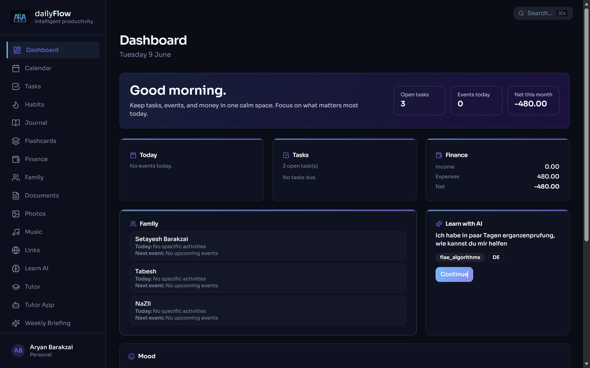
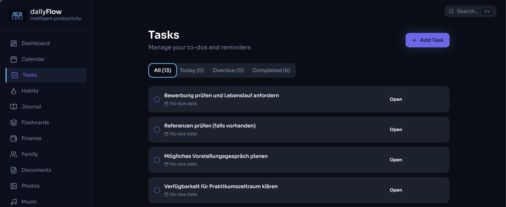
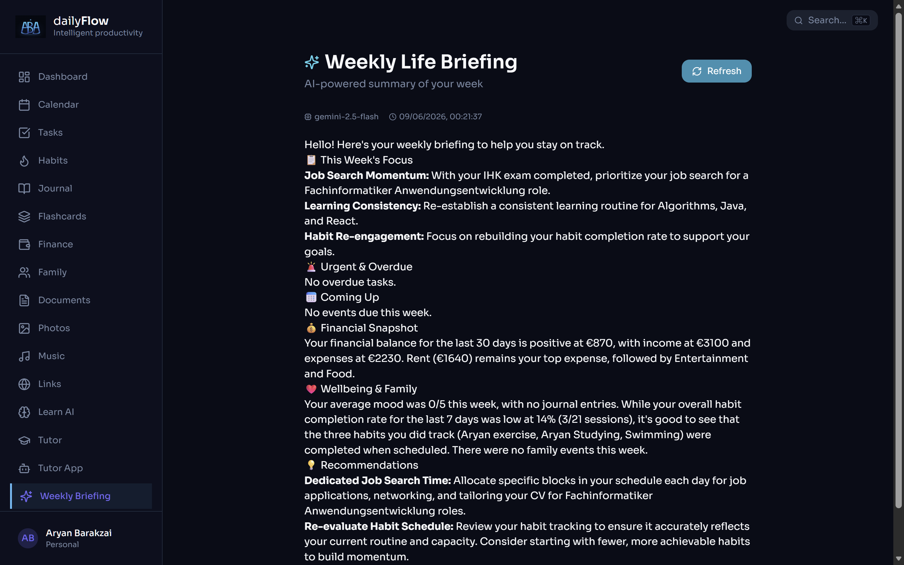
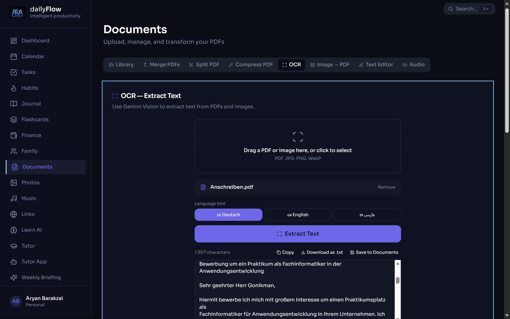
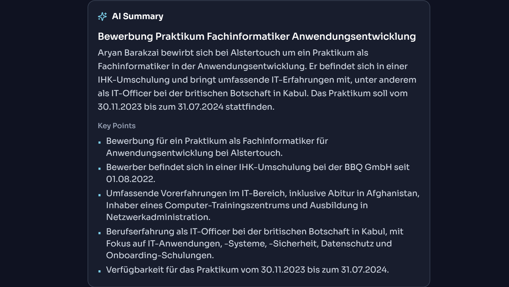
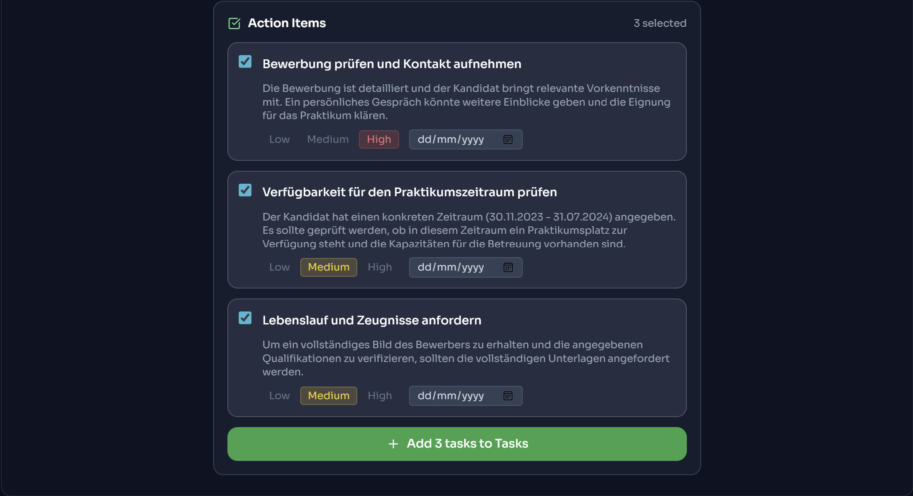

<div align="center">

# DailyFlow

**AI-powered productivity and life management platform**

[](https://barakzai.cloud)
[](https://www.typescriptlang.org/)
[](https://react.dev/)
[](https://supabase.com/)
[](https://pages.cloudflare.com/)

*DailyFlow combines productivity tools, personal organization, document intelligence, AI memory and workflow automation in a single modern application.*

</div>

---

## Overview

DailyFlow is designed as a **personal operating system** — a single platform where tasks, finances, documents, family information and AI assistance live together and connect to each other.

The goal is not only to store information, but to **transform information into actionable outcomes**.

> Built from scratch as part of my retraining as **Fachinformatiker Anwendungsentwicklung (IHK)** and actively used in daily life.

---

## Screenshots

### Dashboard

*Central overview of tasks, finances, habits and AI recommendations.*

### Tasks

*Task management with calendar integration and priority tracking.*

### Weekly AI Briefing

*Personalized weekly summary generated from user activity and stored AI context.*

### OCR Document Processing

*Extract text from PDFs and images using AI-powered OCR.*

### AI Document Summary

*Automatic document analysis and structured summaries.*

### AI Action Items

*AI-generated recommendations extracted from uploaded documents — converted to tasks in one click.*

---

## Core Features

### 🗂️ Productivity
- Task Management with Calendar integration
- Habits Tracking and Mood Correlation
- Journal and Personal Notes
- Flashcards and Exam Preparation (IHK FIAE question bank)
- Personal Dashboard with daily overview

### 📄 Document Intelligence

Upload a document and automatically:
- Extract text using OCR
- Generate AI summaries and key points
- Extract action recommendations
- Create tasks from detected items

```
PDF / Image
    ↓
  OCR
    ↓
AI Summary
    ↓
Key Points
    ↓
Action Items  →  Tasks
```

Supported document types: medical reports, government letters, job center documents, contracts, educational materials.

### 💰 Finance
- Income & expense tracking
- Bank PDF import — Gemini Vision reads Sparkasse statements automatically
- Budget limits and savings goals (Supabase-backed)
- Recurring transactions, charts, and monthly PDF reports

### 🤖 AI Features
- **AI Memory** — `user_context` table personalizes responses over time
- **Weekly Life Briefing** — personalized summary generated from activity and stored context
- **AI Learning Assistant** — Gemini-powered explanations and algorithm practice
- **OCR + AI Summaries** — document-to-task pipeline

### 👨‍👩‍👧 Personal Management
- Family Management
- Shopping → Finance auto-connection
- Photos Library
- Music Library
- Personal Links

---

## Architecture

```
┌─────────────────────────────────────────┐
│        React + TypeScript (Vite)        │
│             Tailwind CSS                │
└────────────────┬────────────────────────┘
                 │
      ┌──────────┴──────────┐
      │                     │
      ▼                     ▼
Supabase (DB)       Cloudflare Workers
PostgreSQL          (dailyflow-ai-worker)
Auth / RLS                  │
Storage              AI Gateway
                     │           │
               Gemini 2.5   Gemini 2.0
               Flash         Flash (fallback)
```

**Infrastructure decisions:**
- Cloudflare Workers handle all AI requests — rate limiting via KV, auth via JWT
- Supabase RLS protects all user data
- Gemini 2.5 Flash → 2.0 Flash automatic fallback
- Auth-protected endpoints: `/tts`, `/briefing`, `/translate`, `/analyze`

---

## Technology Stack

| Layer | Technology |
|-------|------------|
| Frontend | React 18, TypeScript, Vite, Tailwind CSS |
| Rich Text Editor | TipTap (RTL support, AI assist, templates) |
| Backend | Supabase (PostgreSQL, Auth, Storage) |
| AI | Google Gemini 2.5 Flash / 2.0 Flash |
| AI Workers | Cloudflare Workers + KV (rate limiting) |
| Hosting | Cloudflare Pages |
| CI/CD | Auto-deploy on GitHub push |

---

## Getting Started

```bash
# Clone the repository
git clone https://github.com/aryanbarak/dailyflow.git
cd dailyflow

# Install dependencies
npm install

# Configure environment
cp .env.example .env
```

| Variable | Description |
|----------|-------------|
| `VITE_SUPABASE_URL` | Your Supabase project URL |
| `VITE_SUPABASE_ANON_KEY` | Supabase anonymous key |
| `VITE_AI_WORKER_URL` | Cloudflare Worker endpoint for AI |

```bash
# Start development server
npm run dev
```

---

## Current Status

**Implemented and in production:**

`Auth` · `Dashboard` · `Tasks` · `Calendar` · `Habits` · `Journal` · `Finance` · `Bank PDF Import` · `Family` · `Documents` · `OCR` · `AI Summaries` · `AI Memory` · `Weekly Briefings` · `Action Item Generation` · `Flashcards` · `Photos` · `Music` · `PWA Support`

**Planned:**
- Advanced AI agent capabilities
- Extended AI Memory with activity events audit trail
- Structured briefing output (JSON-based)
- Email automation via n8n

---

## Project Log

Active development with session-based changelog. See [PROJECT_STATUS.md](./PROJECT_STATUS.md) for latest commits, known bugs, and next priorities.

---

## Author

**Aryan Barakzai**
Fachinformatiker Anwendungsentwicklung (IHK) · Germany

[](https://github.com/aryanbarak)
[](https://www.linkedin.com/in/aryan-barakzai/)

---

## License

All Rights Reserved — Copyright © Aryan Barakzai

This project is not licensed for public reuse, modification or commercial distribution without explicit written permission from the author.

---

<div align="center">
<sub>Built with ☕ and persistence — from Kabul to Ahrensburg.</sub>
</div>
